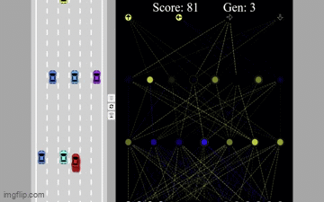
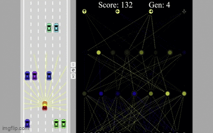

# Self driving car with crossover in genetic algorithms from scratch
## Introduction
This project explores the implementation of a Genetic Algorithm to train a virtual self-driving car with a simple neural network, focusing on the crossover operator, entirely in vanilla JavaScript (no external libraries). The objective is for the car to navigate a simulated environment, avoid obstacles, and complete a track autonomously, leveraging the power of genetic optimization.

You can try it out right [here](https://anhkhoa585.github.io/self-driving-car/).

<p align="center">
  
  
  
  </br>
  <i>Sample results</i>
</p>

## Technologies Used

*   **JavaScript:** The sole programming language used for this project, utilizing standard browser APIs.
*   **HTML5 Canvas:** Used to draw the simulated environment, car, track, and obstacles.
*   **No External Libraries:** This project is built without any third-party libraries or frameworks, providing a deeper understanding of the underlying implementation.
*   **Genetic Algorithm:**
    *   **Crossover:** The crossover operator generates new car "genomes" by combining the "genetic" material of the most successful individuals. In this project, we use a custom crossover where the **best left-turning car's genome is combined with the best right-turning car's genome**.
    *   **Selection:** The fittest cars are selected to pass their genes on to the next generation.
    *   **Mutation:** Adds random variations to the car genomes, preventing premature convergence.
  
## How to Run the Project

1.  **Clone the repository:**
    ```bash
    git clone [repository-url]
    cd [repository-directory]
    ```
2.  **Open `index.html` in your browser:** Simply double-click the `index.html` file or use a local server to view the simulation in your web browser.

## Requirements

*   **No specific requirements beyond a web browser:** Any modern web browser that supports HTML5 and JavaScript will be able to run the project. No additional software installations or libraries are necessary.

## Contributing

Your contributions to this project are welcomed. Feel free to submit pull requests if you have improvements.
